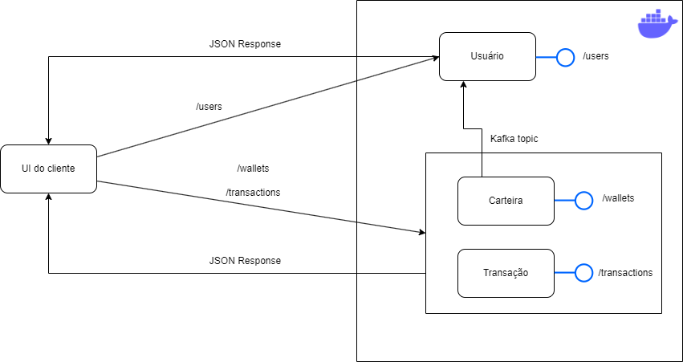

# Projeto Carteira Digital

- Tecnologias Utilizadas
  - **Java** como linguagem de programação.
  - **Docker** como ambiente de execução de containêres. 
  - **Spring Boot** como Container autoconfigurável de DI.
  - **Spring Cloud OpenFeign** para comunicação síncrona.
  - **Spring Data JPA** para ORM.
  - **PostgreSQL** para Banco de Dados.
  - **PgAdmin** como administrador do BD.
  - **Apache Kafka** para mensageria.
  - **Maven** como gerenciador de dependências.
  - **JaCoCo** para report de cobertura de código.

- Foi implementado uma API REST de carteira digital neste projeto.
- Este projeto contém dois serviços:
  - Serviço de Usuário (user).
  - Serviço de Carteira (Wallet).

## Como executar o projeto?
- O projeto foi configurado para executar em ambiente Docker, foi utilizado o arquivo docker-compose.yml para declarar 
as dependências e as imagens que serão utilizadas para execução conjunta do projeto. Para executar o projeto execute os seguintes passos:
  1. Realize o build dos projetos (user e wallet) utilizando o maven executando o seguinte comando (maven goal) para os dois projetos: `mvn clean install -DskipTests`.
  2. Quando terminar a execução do comando do maven, valide que o arquivo user-service.jar e o wallet-service.jar estão em suas respectivas pastas `/target`.
  3. Agora o próximo comando a ser executado é o `docker-compose up --build` no diretório onde o arquivo docker-compose.yml está localizado, com este comando ele criará e executará as dependências do projeto juntamente com os serviços de carteira e de usuário.
  4. Pronto, agora basta executar as requisições para validar os requisitos funcionais.

## Serviço de Usuário
- Um usuário tem os seguintes campos:
  - **userId** - Identificador do usuário, único, gerado automaticamente e do tipo UUID.
  - **username** - Nome do usuário do usuário, único e do tipo String. (Tamanho mínimo = 2, Tamanho máximo = 25)
  - **firstName** - Primeiro nome do usuário, do tipo String. (Tamanho mínimo = 2, Tamanho máximo = 20)
  - **socialSecurityNumber** - CPF do usuário, do tipo String. (Tamanho = 11, sem travessão)
  - **lastName** - Sobrenome do usuário, do tipo String. (Tamanho mínimo = 2, Tamanho máximo = 20)
  - **createdAt** - Data em que o usuário foi criado, do tipo Date (Java).
  - **walletId** - Identificador da carteira digital respectiva a este usuário, do tipo UUID.
- O serviço de usuário executa na máquina local e na porta `8081`, basta enviar as requisições para o seguinte endereço `http://localhost:8081`,e ele contém os seguintes endpoints:


## API do serviço de Usuário
### POST /users - Cria um usuário
- Status HTTP OK, foi criado com sucesso, caso contrário, HTTP Bad Request 
- Este endpoint provê um recurso para criar usuário, e ele espera um texto em formato JSON no corpo da requisição e com os seguintes campos:
  - ```json
        {
          "username": "foobar",
          "firstName": "foo",
          "lastName": "bar",
          "socialSecurityNumber": "12345678900"
        }
    ``` 
- A resposta dessa requisição é no seguinte formato:
  - ```json
      {
        "userId": "961337fd-8f39-4eb9-a421-9c36eaa9a5ef",
        "username": "foobar",
        "firstName": "foo",
        "socialSecurityNumber": "12345678900",
        "lastName": "bar",
        "createdAt": "2023-07-31T02:39:11.398+00:00",
        "walletId": null
      }
      ``` 
    > O campo `walletId` da resposta desta requisição é null pois não é gerado a carteira digital automaticamente. Para gerar a carteira digital para o usuário consulte o endpoint POST /wallets

### GET /users - Busca usuários com paginação - Parâmetros: page (int), size (int)
- Status HTTP OK, foi achado com sucesso, caso contrário, HTTP Bad Request
- Este endpoint provê a busca de usuários com paginação e espera dois parâmetros de requisição: page e size. 
- Ele não requer nenhum campo na corpo da requisição. Somente dois parâmetros, page e size.
- A resposta dessa requisição é no seguinte formato para uma requisição `GET http://localhost:8081/users?page=0&size=2`:
  - ```json
      [
            {
                "userId": "005814a1-0826-4963-bfed-fd501ca3ceda",
                "username": "foobar",
                "firstName": "foo",
                "socialSecurityNumber": "12345678900",
                "lastName": "bar",
                "createdAt": "2023-07-31",
                "walletId": "6dd40501-a9f3-4ad0-b140-2696705dde61"
            },
            {
                "userId": "961337fd-8f39-4eb9-a421-9c36eaa9a5ef",
                "username": "corge",
                "firstName": "waldo",
                "socialSecurityNumber": "00987654321",
                "lastName": "corge",
                "createdAt": "2023-07-31",
                "walletId": "d8fa4f91-f1c8-4cb7-9cc5-22a017fcf6df"
            }
      ]
    ```
    > O campo `walletId` da resposta desta requisição pode ser nulo ou não dependendo se uma carteira digital já foi criada para estes usuários. 

### GET /users/{id} - Busca usuários por id - Parâmetros: id (UUID)
- Status HTTP OK, foi achado com sucesso, caso contrário, HTTP Not Found
- Este endpoint provê a busca de usuários por identificador e espera um parâmetro, o identificador do usuário a ser buscado. 
- Ele não requer nenhum campo no corpo da requisição.
- A resposta dessa requisição é no seguinte formato para uma requisição `GET http://localhost:8081/users/961337fd-8f39-4eb9-a421-9c36eaa9a5ef`:
  - ```json
      {
        "userId": "961337fd-8f39-4eb9-a421-9c36eaa9a5ef",
        "username": "corge",
        "firstName": "waldo",
        "socialSecurityNumber": "00987654321",
        "lastName": "corge",
        "createdAt": "2023-07-31",
        "walletId": "d8fa4f91-f1c8-4cb7-9cc5-22a017fcf6df"
      }
    ```
> O campo `walletId` da resposta desta requisição pode ser nulo ou não dependendo se uma carteira digital já foi criada para este usuário.

### PUT /users - Atualiza um usuário pelo identificador 
- Status HTTP OK, foi atualizado com sucesso, caso contrário, HTTP Not Found.
- Para atualizar um usuário é necessário que ele esteja criado, e com isso, tem que obter o identificador dele e embutir
na requisição no campo userId.
- Este endpoint provê a atualização de um usuário por identificador, não há parâmetros esperados, somente o corpo da 
requsição com o usuário à ser alterado, no seguinte formato:
  - ```json
      {
          "userId": "961337fd-8f39-4eb9-a421-9c36eaa9a5ef",   
          "username": "corge",
          "firstName": "corge",
          "lastName": "waldo",
          "socialSecurityNumber": "12345678900"
      }
    ``` 
- A resposta para a uma requisição `PUT /users` requisição é no seguinte formato:
    - ```json
        {
          "userId": "961337fd-8f39-4eb9-a421-9c36eaa9a5ef",
          "username": "corge",
          "firstName": "corge",
          "socialSecurityNumber": "12345678999",
          "lastName": "waldo",
          "createdAt": "2023-07-31",
          "walletId": "d8fa4f91-f1c8-4cb7-9cc5-22a017fcf6df"
        }
      ```
        
### DELETE /users/{id} - Remove um usuário por id - Parâmetros: id (UUID)
- Status HTTP OK, foi removido com sucesso, caso contrário, HTTP Not Found
- Este endpoint provê a remoção de um usuário por identificador e espera um parâmetro, o identificador do usuário a ser removido.
- Ele não requer nenhum campo no corpo da requisição.
- Este endpoint não provê nenhuma resposta, apenas o status http se foi removido com sucesso ou não.
- Exemplo de requisição: `DELETE http://localhost:8081/users/961337fd-8f39-4eb9-a421-9c36eaa9a5ef`

## Serviço de Carteira
- O serviço de carteira tem dois componentes em seu domínio:
  - Carteira (Wallet): Representa a carteira digital de um usuário com seu histórico de transações e outros campos.
  - Transação (Transaction): Representa a transação em si, com o seu valor, identificador da carteira e outros campos.
-  A carteira tem os seguintes campos:
    - **walletId** - Identificador da carteira digital, gerado automaticamente e do tipo UUID.
    - **userId** - Identificador do dono da carteira digital, gerado automaticamente e do tipo UUID. 
    - **transactions** - Histórico de transações realizadas, e do tipo Transaction.
    - **balance** - Saldo da carteira digital, inicialmente zero, e do tipo Double.

- A transação tem os seguintes campos:
  - **transactionId** - Identificador da transação, gerado automaticamente, e do tipo UUID.
  - **timestamp** - Data em que foi criada a transação, do tipo Date.
  - **amount** - O valor da transação, do tipo Double.
  - **walletId** -Identificador da carteira de origem onde a transação foi realizada, do tipo UUID.
  - **targetWallet** - Identificador da carteira destino **caso seja uma transação de Transferência**, do tipo UUID.
  - **transactionType**: - Tipo da transação, pode ser um dos seguintes valores:
    - BILL_PAYMENT - Pagamento de títulos.
    - WITHDRAW - Saque.
    - DEPOSIT - Depósito.
    - TRANSFER - Transferência
- O serviço de carteira executa na máquina local e na porta `8080`, basta enviar as requisições para o seguinte endereço `http://localhost:8080`,e ele contém os seguintes endpoints:
## API de Carteira
### POST /wallets - Cria uma carteira digital com base no corpo da requisição
- Status HTTP OK, foi criado com sucesso, caso contrário, HTTP Bad Request.
- Este endpoint provê o recurso de criar uma carteira digital com base no identificador embutido no corpo da requisição.
  - Um exemplo de requisição para `POST /wallets` com o seguinte corpo é :
  - ```json
    {
        "userId": "961337fd-8f39-4eb9-a421-9c36eaa9a5ef"
    }
    ``` 
  - Um exemplo de resposta para esta requisição é:
    - ```json
      {
        "walletId": "d8fa4f91-f1c8-4cb7-9cc5-22a017fcf6df",
        "userId": "961337fd-8f39-4eb9-a421-9c36eaa9a5ef",
        "transactions": [],
        "balance": "0"
      }
      ```

### GET /wallets - Busca carteiras com paginação - Parâmetros: page (int), size (int)
- Status HTTP OK, foi achado com sucesso, caso contrário, HTTP Bad Request.
- Este endpoint provê a busca de carteiras com paginação e espera dois parâmetros de requisição: page e size.
- Ele não requer nenhum campo na corpo da requisição. Somente dois parâmetros, page e size.
- A resposta dessa requisição é no seguinte formato para uma requisição `GET http://localhost:8080/wallets?page=0&size=1`:
  - ```json
      [
        {
          "walletId": "d8fa4f91-f1c8-4cb7-9cc5-22a017fcf6df",
          "userId": "961337fd-8f39-4eb9-a421-9c36eaa9a5ef",
          "transactions": [],
          "balance": "0"
        }
      ]
    ```

### GET /wallets/{id} - Busca carteiras por id - Parâmetros: id (UUID)
- Status HTTP OK, foi achado com sucesso, caso contrário, HTTP Not Found.
- Este endpoint provê a busca de carteiras por identificador e espera um parâmetro, o identificador da carteira a ser buscada.
- Ele não requer nenhum campo no corpo da requisição.
- A resposta dessa requisição é no seguinte formato para uma requisição `GET http://localhost:8080/wallets/961337fd-8f39-4eb9-a421-9c36eaa9a5ef`:
  - ```json
      {
        "walletId": "d8fa4f91-f1c8-4cb7-9cc5-22a017fcf6df",
        "userId": "961337fd-8f39-4eb9-a421-9c36eaa9a5ef",
        "transactions": [],
        "balance": "0"
      }
    ```
### DELETE /wallets/{id} - Remove uma carteira por id - Parâmetros: id (UUID)
- Status HTTP OK, foi removido com sucesso, caso contrário, HTTP Not Found.
- Este endpoint provê a remoção de uma carteira por identificador e espera um parâmetro, o identificador da carteira a ser removida.
- Ele não requer nenhum campo no corpo da requisição.
- Este endpoint não provê nenhuma resposta, apenas o status http se foi removido com sucesso ou não.
- Exemplo de requisição: `DELETE http://localhost:8081/wallets/961337fd-8f39-4eb9-a421-9c36eaa9a5ef`

## API de Transação
- Todos métodos da camada de serviço de transação, são transacionais.
### POST /transactions/deposit - Realiza o depósito na carteira de um usuário
- Status HTTP OK, se foi depositado com sucesso, caso contrário uma excessão será gerada.
- Este endpoint provê o depósito em uma carteira, ela espera um objeto JSON no seguinte formato:
  - ```json
      {
        "amount": 1000.0,
        "walletId": "d8fa4f91-f1c8-4cb7-9cc5-22a017fcf6df",
        "userId": "961337fd-8f39-4eb9-a421-9c36eaa9a5ef"
      }
    ```  
- A resposta para este recurso é apenas o status HTTP OK. É possível validar o saldo, enviando uma
nova requisição `GET /wallets?page=0&size=2` por exemplo.

### POST /transactions/transfer - Realiza a transferência de valores entre carteiras 
- Status HTTP OK se foi transferido com sucesso, caso contrário, uma excessão será gerada.
- Este endpoint provê a transferência de valores entre contas, ele espera um objeto JSON no seguinte formato:
  - ```json
      {
        "sourceWallet": "d8fa4f91-f1c8-4cb7-9cc5-22a017fcf6df",
        "targetWallet": "961337fd-8f39-4eb9-a421-9c36eaa9a5ef",
        "amount": 1000.0
      }
    ``` 
- A resposta para este recurso é apenas o status HTTP OK. É possível validar o saldo, enviando uma
  nova requisição `GET /wallets?page=0&size=2` por exemplo.

### GET /transactions/withdraw - Realiza o saque de um determinado valor de uma carteira
- Status HTTP OK, se o saque foi realizado com sucesso, caso contrário, uma excessão será gerada.
- Este endpoint provê o saque de um valor de uma conta, ele espera um objeto JSON no seguinte formato:
  - ```json
      {
        "sourceWallet": "d8fa4f91-f1c8-4cb7-9cc5-22a017fcf6df",
        "amount": 1000.0
      }
    ``` 
- A resposta para este recurso é apenas o status HTTP OK. É possível validar o saldo, enviando uma
  nova requisição `GET /wallets?page=0&size=2` por exemplo.

### POST /transactions/bill - Realiza o pagamento de títulos com base em uma carteira
- Status HTTP OK, se o pagamento foi realizado com sucesso, caso contrário, uma excessão será gerada.
- Este endpoint provê o pagamento de títulos de uma conta, ele espera um objeto JSON no seguinte formato:
  - ```json
      {
        "sourceWallet": "d8fa4f91-f1c8-4cb7-9cc5-22a017fcf6df",
        "amount": 1000.0
      }
    ``` 
- A resposta para este recurso é apenas o status HTTP OK. É possível validar o saldo, enviando uma
  nova requisição `GET /wallets?page=0&size=2` por exemplo.

## Observações
- A comunicação assíncrona foi implementada via Kafka ao criar uma carteira digital e ao removê-la, vulgo `POST /wallets` e `DELETE /wallets/{id}`.
- É possível verificar a cobertura de código executando o seguinte comando em cada um dos projetos: `mvn clean jacoco:prepare-agent install jacoco:report`.
  - Foi testado somente a camada de serviço e suas regras de negócio.

## Arquitetura

